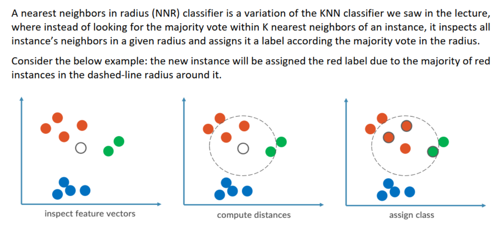
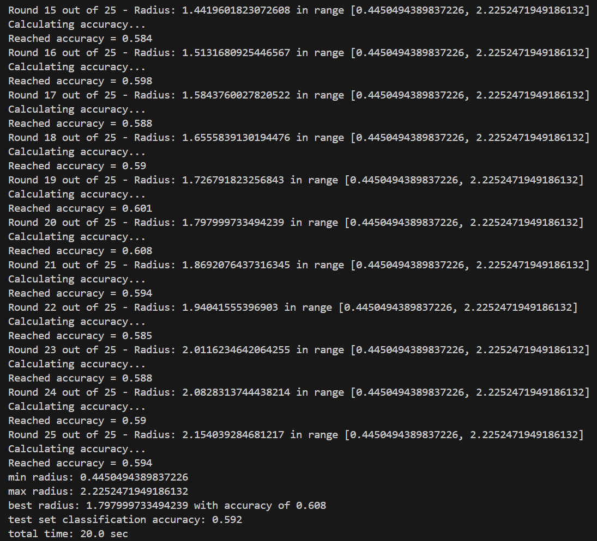

# NNR Classifier

## Overview
This project implements a **Nearest Neighbors in Radius (NNR) classifier**, a variation of KNN where classification is based on neighbors within a fixed radius.

## Visualization

## How It Works
### 1. Data Processing
- Reads train, validation, and test datasets.

### 2. Feature Scaling
- Standardizes feature values using `StandardScaler`.

### 3. Radius Selection
- Determines the optimal radius using validation data by testing multiple values.

### 4. Prediction
- Assigns labels based on the majority vote within the best radius.

### 5. Evaluation
- Computes classification accuracy.

## Dependencies
- Python
- NumPy
- Pandas
- Scikit-learn

## Output
- Best radius and accuracy on the validation set.
- Predictions for the test set.
- Final classification accuracy.

